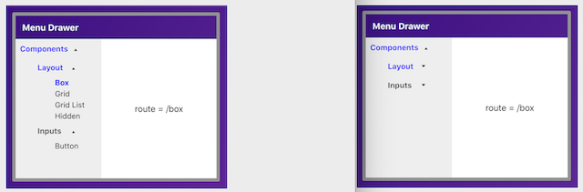

## Menu Drawer [(demo)](https://menu-drawer.herokuapp.com/)

### _Nested Accordion + Inversion-of-Control === Menu Drawer_


_<h6>Photo by <a href="https://unsplash.com/photos/QCPv6G4dMN0">Matt Briney</a></h6>_

Add a menu drawer to your React application with a single hook (by transforming an accordion component).

[](https://menu-drawer.herokuapp.com/)


## [Contents](#contents)

- [Overview](#overview)
- [Bootstrap repos](#bootstrap-repos)
- [Just add data](#just-add-data)
- [Fix regressions](#fix-regressions)
- [Dev Work](#dev-work)
  - [Update schema with routes](#update-schema-with-routes)
  - [Add some text styling](#add-some-text-styling)
  - [Route drives content](#route-drives-content)
  - [Menu Layout Reducer](#menu-layout-reducer)
  - [Menu Expansion Reducer](#menu-expansion-reducer)
  - [Let routes drive focal index](#let-routes-drive-focal-index)
  - [Style focal parents](#style-focal-parents)
  - [useMenuDrawer hook](#usemenudrawer-hook)
- [**Demo**](https://menu-drawer.herokuapp.com/) ☚
- [Summary](#summary)

## [Overview](#contents)

In this project, I leverage the `inversion of control` principle I recently learned from [Kent Dodds](https://kentcdodds.com/blog/inversion-of-control) to transform a [&lt;NestedAccordion&gt;](https://github.com/zenglenn42/inversion-of-control/blob/master/README.md) component into a menu drawer, a staple of many user interfaces.

## [Bootstrap repos](#contents)

I bootstrap this repo directly from the `inversion-of-control` repo where the nested accordion lives.

* Update the branding text and icons in ./public
* Strip down the README and ./docs/images
* Update project data in packages.json
* Rework the src/App.js demo page jsx/html
* Verify I can render the nested accordion in the new environment
* Publish to github

Then I setup my deployment path

* Create a `menu-drawer` app on Heroku
* Add the `mars/create-react-app-buildpack` from my local github repo
    * heroku login
    * heroku buildpacks:set mars/create-react-app-buildpack
* Add a heroku remote
    * git add remote heroku https://git.heroku.com/menu-drawer.git
* Test the deployment build
    * git push heroku master
    
## [Just add data](#contents)

The Accordion is data-driven so I populate `inputdata.js` with the desired menu text.
(I'm using the [Material-UI menu](https://material-ui.com/) as a template.)

```javascript
# src/api/inpustdata.js

export const drawerItems = [
  {
    title: 'Components',
    items: [
      {
        title: 'Layout',
        items: [
          {
            title: 'Box',
            contents: (
              <div>box content</div>
            )
          },
          ..
        ]
      },
      ..
    ]
  }
]
```

This gets consumed in `src/App.js`

```javascript
import { drawerItems } from './api/inputdata'
import {
  nestedItemsClosure,
  nestedLayoutReducer,
  singlePeerExpandedReducer
} from './components/NestedAccordion/NestedAccordion'

function App() {
  return (
    <>
        <Accordion
            items={drawerItems}     // <-- :-)
            inputItemsReducer={nestedItemsClosure()}
            layoutReducer={nestedLayoutReducer}
            expansionReducer={singlePeerExpandedReducer}
        />
    </>
  )
}
```

## [Fix regressions](#contents)

I find one CSS/JSS [styling issue](https://github.com/zenglenn42/menu-drawer/blob/6bda2a7b00f56b385b96fa12f8bb497ae054c2d3/src/components/Accordion/Accordion.js#L7) that horizontally trucates the menu within its parent accordion div.

I find a [minor logic](https://github.com/zenglenn42/menu-drawer/blob/6bda2a7b00f56b385b96fa12f8bb497ae054c2d3/src/components/NestedAccordion/NestedAccordion.js#L174) issue affecting expansion attributes of child elements with 0-index parents.

## [Dev work](#contents)

Most of the feature work revolves around styling idioms typical of menu drawers and integration with React Router (so item selection can drive an adjacent content window).

### [Update schema with routes](#contents)

Accordions don't have routes, just text `content` that comes from the input data.  I alter the schema to support menu selection route:

```javascript
# src/api/inputdata.js

export const nestedMenuData = [ 
  {
    title: 'Components',
    items: [
      {   
        title: 'Layout',
        items: [
          {
            title: 'Box',
            route: '/box'  // <--
          },
          {
            title: 'Grid',
            route: '/grid' // <--
          },
          ..
        ]
      },
      ..
    ]
  }
]
```

### [Add some text styling](#contents)

I confer [bold text](https://github.com/zenglenn42/menu-drawer/blob/6bda2a7b00f56b385b96fa12f8bb497ae054c2d3/src/components/NestedAccordion/NestedAccordion.js#L155) upon expanded menu drawer items.

### [Route drives content](#contents)

Menu drawer clicks typically drive application routes of some sort to request a new page from the server or to render content associated with a client-side route (typical with single page architecture).  In this case, it will be the former with clicks driving react-router:

```javascript
# components/MenuDrawerApp.js

import React from 'react'
import { Switch, Route, BrowserRouter as Router } from 'react-router-dom'

function App() {
  return (
    <Router>
        <header className="articleTitle">{title}</header>
        <main className="mainMenuApp" >
            <div className="menuDrawer" >
                <MenuDrawer />
            </div>
            <div className="contentFrame" >
                <Switch>
                    <Route exact from="/">
                        <Content className="content" />
                    </Route>
                    <Route from="/:route" >
                        <Content className="content" />
                    </Route>
                </Switch>
            </div>
        </main>
    </Router>
  )
}

```

### [Menu Layout Reducer](#contents)

I wrapper each menu item with a click-sensitive `<Link to={route}>` component which passes control to the router so route-sensitive content may be displayed.

```javascript
# components/MenuDrawer.js

function menuLayoutReducer(components, action) {
  const { allItems, focalIndex } = action
  const focalRoute = (focalIndex === undefined) ? '/' : allItems[focalIndex].route

  switch (action.type) {
    case layoutActionTypes.map_items:
      const menu = allItems.map((item, index) => {
          return (
            <AccordionItem >
              // :-) Sets route on click.
              <Link to={item.route || focalRoute} >
                <AccordionButton> .. </AccordionButton>
              </Link>
            </AccordionItem>
          )
      })
      return menu
  }
}
```

### [Menu Expansion Reducer](#contents)

The expand / collapse behavior for a menu drawer is slightly different from the `<NestedAccordion>` component we're extending.

We still want basic accordion behavior when a menu category or sub-category is clicked open or closed.  However, for _leaf node_ items (e.g., `Box`, `Grid`), we simply want to select the item.  There's no concept of de-selecting or toggling `closed` in this case.  So we don't need to track the expanded state of routable menu selections in [useExpandable](https://github.com/zenglenn42/menu-drawer/blob/6d092fd7ae9e12df55fe0ac1cc71f43819ebb0c7/src/components/Accordion/useExpandable.js#L91).

This implies a need to override the accordion's default expansionReducer with [route-sensitive logic](https://github.com/zenglenn42/menu-drawer/blob/6d092fd7ae9e12df55fe0ac1cc71f43819ebb0c7/src/components/MenuDrawer/MenuDrawer.js#L176).

You can see the code [here](https://github.com/zenglenn42/menu-drawer/blob/41707d7ecff610e6579253c52f2921e6b94e3be0/src/components/MenuDrawer/MenuDrawer.js#L126).

## [Let routes drive focal index](#contents)

So, everything seems to be working.  

Menu clicks are reaching `<Link to={route}>` components, triggering routes, and displaying new stuff in our content area.

But there is a disturbance in the force.

What if the user has *bookmarked* their favorite route and wants to return to that content the next day?  

React router does that right thing and displays corresponding content for that route, but the menu drawer does not reflect that 'selection'. No nice blue bold text. It's an annoying fail for the user experience. &nbsp; :-(

We need focalIndex to be driven by menu clicks &nbsp; `and by ...`

* application routes specified in the url
  * `/box` in `https://menu-drawer.herokuapp.com/box`


I'm mindful of inversion-of-control and would like avoid mutating low-level components, but my earlier decision (taken with the NestedAccordion) to add `focalIndex` to the state managed by `useExpandable` presents a slippery slope.  There's just a lot less impedance if I augment the reducer therein with a `set_focal_index` [action](https://github.com/zenglenn42/menu-drawer/blob/387a9f16abd06e1206dc09c09273c2cc920666bc/src/components/Accordion/useExpandable.js#L50) and export a corresponding helper function similar to what we're alreadying doing with `toggleExpander`.  This doesn't break old accordions since we're adding new functionality, not changing a legacy interface.

I let the new `setFocalIndex` bubble up from useExpandable to useAccordion:

```javascript
# useExpandable.js

function useExpandable() {
  ..
  const setFocalIndex = (index) => {
    if (typeof index === 'number' && index >= 0 && index < items.length) {
      if (index !== focalIndex) {
        dispatch({
          type: actionTypes.set_focal_index,
          index: index,
          allItems: items
        })
      } 
    }
  }

  return { expandedItems, focalIndex, toggleExpander, setFocalIndex }
                                                      -------------
```

```javascript
# useAccordion.js

function useAccordion() {
  ..
  const { expandedItems, focalIndex, toggleExpander, setFocalIndex } = useExpandable()
  return { components, setFocalIndex }
}
```

which is now visible, finally, to our router code:

```javascript
# components/MenuDrawerApp.js

function MenuDrawerApp(props) {
    const { items, title, initialExpandedItems = [] } = props
    const flattenedMenuData = menuDataReducer(items)
    const { components, setFocalIndex } = useAccordion({
        items: flattenedMenuData,
        initialExpandedItems: initialExpandedItems,
        layoutReducer: menuLayoutReducer,
        expansionReducer: menuExpansionReducer
    })
    const MenuDrawer = () => (<div>{components}</div>)

    return (
        <Router>
            <header className="articleTitle">{title}</header>
            <main className="mainMenuApp" >
                <div className="menuDrawer" >
                    <MenuDrawer />
                </div>
                <div className="contentFrame" >
                    <Switch>
                        <Route exact from="/">
                            <Content className="content" />
                        </Route>
                        <Route from="/:route" >
                            <Content 
                                className="content" 
                                flattenedMenuData={flattenedMenuData} 
                                getIndexFromRoute={getIndexFromRoute} 
                                setFocalIndex={setFocalIndex} 
                            />
                        </Route>
                    </Switch>
                </div>
            </main>
        </Router>
    )
}
```

To finish the story, the `<Content>` component invokes `setFocalIndex` since it has awareness of the current route.  (A simple [helper function](https://github.com/zenglenn42/menu-drawer/blob/387a9f16abd06e1206dc09c09273c2cc920666bc/src/components/MenuDrawer/MenuDrawer.js#L46) returns the desired menu item index given the current route.)

```javascript
# Content.js

import React, { useEffect, useCallback } from 'react'
import { useParams } from 'react-router-dom'

export const Content = (props) => {
    const { className, getIndexFromRoute = () => {}, flattenedMenuData, setFocalIndex = () => {} } = props
    const { route = '/' } = useParams()
    const text = route === ("/") ? 'select menu item' : `route = /${route}`
    useEffect(()=> {
        if (route) {
            const index = getIndexFromRoute(`/${route}`, flattenedMenuData)
            setFocalIndex(index)
        }
    }, [route, flattenedMenuData, getIndexFromRoute, setFocalIndex])
    return (<div className={className}>{text}</div>)
}
```

Now the useExpandable drawer state is consistent with the current route regardless if specified as part of a URL or in response to a menu item click.

## [Style focal parents](#contents)

I define the notion of `focalParents` so I can uniquely style all the parents leading to a given selection:



This provides a visual hint for locating a selected item in the menu if one or more focal parents are rolled-up.

## [useMenuDrawer hook](#contents)

It's interesting to experience the natural pull toward a custom hook.  Obviously I've been riffing on useAccordion and useExpandable for awhile, so I'm increasingly comfortable with thinking about code reuse in those terms.  

Nominally, I've considered a menu drawer hook, but was simply getting by with this:

```javascript
# MenuAppDrawer.js

    const { components, setFocalIndex } = useAccordion({
      items: flattenedMenuData,
      initialExpandedItems: initialExpandedItems,
      layoutReducer: menuLayoutReducer,
      expansionReducer: menuExpansionReducer
    })
    const MenuDrawer = () => (<div>{components}</div>)
    ...

    return(
      <MenuDrawer />
    )
```

However, I've been thinking about adding scroll persistence to the drawer, a thoughtful feature for long menus so the user doesn't have to hunt around for where they left off after minimizing / maximizing the menu.

But where should I persist that state?  Doesn't feel right to lump it into MenuDrawerApp.js since scroll position is really intrinsic to the menu drawer itself.  I could stash it in useAccordion, I suppose, but scroll persistence in an accordion seems an odd fit.  I've not run into many massively long accordions in my experience.  Plus, I'm curious to see if I can leverage inversion-of-control to leave the underlying component alone while implementing a higher level component.

It seems fitting to persist scroll position within the MenuDrawer.js code.  But I don't have a hook there yet.  Since I'll still need to wrapper useAccordion in his own hook, it stands to reason I should create a useMenuDrawer hook to wrapper the accordion.

I end up with this:

```javascript

# MenuDrawer.js

export function useMenuDrawer(props) {
  const { 
          items = [], 
          initialExpandedItems = [], 
          inputItemsReducer = menuDataReducer,
          layoutReducer = menuLayoutReducer, 
          expansionReducer = menuExpansionReducer } = props

  const flattenedMenuData = inputItemsReducer(items)

  const { components, setFocalIndex : setAccordionFocalIndex } = useAccordion({
    items: flattenedMenuData,
    initialExpandedItems: (typeof initialExpandedItems === 'function') 
                      ? initialExpandedItems() 
                      : initialExpandedItems,
    layoutReducer: layoutReducer,
    expansionReducer: expansionReducer,
  })
  
  const dfltClassName = 'menuDrawer'  // Style the div holding the menu
  const MenuDrawer = (props) => {
    return (
      <div className={props.className || dfltClassName }>
        {components}
      </div>
    )
  }

  const setFocalIndexFromRoute = (route) => {
    const index = getIndexFromRoute(route, flattenedMenuData)
    setAccordionFocalIndex(index)
  }

  return { MenuDrawer, setFocalIndexFromRoute }
}
```

It allows me to clean-up the interface between the menu drawer and the app that consumes the drawer.  I no longer need to expose all the helper functions and default reducers anymore.  Plus I now have a `<MenuDrawer>` component that is reasonably named and supports a className prop for styling the enclosing `<div>`.

```javascript
# MenuDrawerApp.js

function MenuDrawerApp(props) {
    const { items, title, initialExpandedItems = [] } = props
    const { MenuDrawer, setFocalIndexFromRoute } = useMenuDrawer({
        items: items,
        initialExpandedItems: initialExpandedItems,
    })

    return (
        <Router>
            <header className="articleTitle">{title}</header>
            <main className="mainMenuApp" >
                <MenuDrawer className="menuDrawer" />
                <div className="contentFrame" >
                    <Switch>
                        <Route exact from="/">
                            <Content className="content" />
                        </Route>
                        <Route from="/:route" >
                            <Content 
                                className="content" 
                                setFocalIndex={setFocalIndexFromRoute} 
                            />
                        </Route>
                    </Switch>
                </div>
            </main>
        </Router>
    )
}
```

This just feels right.  I also have a logical place, `useMenuDrawer`, to add scroll persistence.

## [Summary](#contents)

By altering the input data schema and customizing two reducers, I morphed a [&lt;NestedAccordion&gt;](https://github.com/zenglenn42/inversion-of-control/blob/master/README.md) into a `router-ready` menu drawer using (and sometimes [abusing](#let-routes-drive-focal-index)) the `inversion of control` principle discussed [here](https://github.com/zenglenn42/inversion-of-control/blob/master/README.md).  

Most of the cognitive work came with the requirement to drive focalIndex with menu clicks *or* routes specified in the URL.

I now have something scalable that manages state sensibly and may be integrated into other projects of mine.
