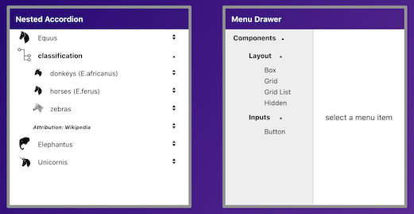

## Menu Drawer [(demo)](https://menu-drawer.herokuapp.com/)

### _Nested Accordion + Inversion-of-Control === Menu Drawer_

[](https://menu-drawer.herokuapp.com/)


## [Contents](#contents)

- [Overview](#overview)
- [Bootstrap repos](#bootstrap-repos)
- [Just add data](#just-add-data)
- [Fix regressions](#fix-regressions)
- [Dev Work](#dev-work)
  - [Add some text styling](#add-some-text-styling)
  - [Route drives content](#route-drives-content)
  - [Add routes to input data](#add-routes-to-input-data)
  - [Menu Layout Reducer](#menu-layout-reducer)
  - [Menu Expansion Reducer](#menu-expansion-reducer)
  - [Let routes drive focal index](#let-routes-drive-focal-index)
- [**Demo**](https://menu-drawer.herokuapp.com/) ☚
- [Summary](#summary)

## [Overview](#contents)

These days I'm working with React, Facebook's user interface library for web applications.

In this project, I leverage the `inversion-of-control` principle (discussed 
[here](https://github.com/zenglenn42/inversion-of-control/blob/master/README.md))
to transform a Nested Accordion component into a menu drawer, a staple of many user interfaces.

## [Bootstrap repos](#contents)

I bootstrap this repo directly from the `inversion-of-control` repo where the nested accordion lives.

* Update the branding text and icons in ./public
* Strip down the README and ./docs/images
* Update project data in packages.json
* Rework the src/App.js demo page jsx/html
* Verify I can render the nested accordion in the new environment
* Publish to github

Then I setup my deployment path

* Create a `menu-drawer` app on Heroku
* Add the `mars/create-react-app-buildpack` from my local github repo
    * heroku login
    * heroku buildpacks:set mars/create-react-app-buildpack
* Add a heroku remote
    * git add remote heroku https://git.heroku.com/menu-drawer.git
* Test the deployment build
    * git push heroku master
    
## [Just add data](#contents)

The Accordion is data-driven so I populate `inputdata.js` with the desired menu text.
(I'm using the [Material-UI menu](https://material-ui.com/) as a template.)

```javascript
# src/api/inpustdata.js

export const drawerItems = [
  {
    title: 'Components',
    items: [
      {
        title: 'Layout',
        items: [
          {
            title: 'Box',
            contents: (
              <div>box content</div>
            )
          },
          ..
        ]
      },
      ..
    ]
  }
]
```

This gets consumed in `src/App.js`

```javascript
import { drawerItems } from './api/inputdata'
import {
  nestedItemsClosure,
  nestedLayoutReducer,
  singlePeerExpandedReducer
} from './components/NestedAccordion/NestedAccordion'

function App() {
  return (
    <>
        <Accordion
            items={drawerItems}     // <-- :-)
            inputItemsReducer={nestedItemsClosure()}
            layoutReducer={nestedLayoutReducer}
            expansionReducer={singlePeerExpandedReducer}
        />
    </>
  )
}
```

## [Fix regressions](#contents)

I find one CSS/JSS [styling issue](https://github.com/zenglenn42/menu-drawer/blob/6bda2a7b00f56b385b96fa12f8bb497ae054c2d3/src/components/Accordion/Accordion.js#L7) that horizontally trucates the menu within its parent accordion div.

I find a [minor logic](https://github.com/zenglenn42/menu-drawer/blob/6bda2a7b00f56b385b96fa12f8bb497ae054c2d3/src/components/NestedAccordion/NestedAccordion.js#L174) issue affecting expansion attributes of child elements with 0-index parents.

## [Dev work](#contents)

Most of the feature work revolves around styling idioms typical of menu drawers and integration with React Router (so item selection can drive an adjacent content window).

### [Add some text styling](#contents)

I confer [bold text](https://github.com/zenglenn42/menu-drawer/blob/6bda2a7b00f56b385b96fa12f8bb497ae054c2d3/src/components/NestedAccordion/NestedAccordion.js#L155) upon expanded menu drawer items.

### [Route drives content](#contents)

Menu drawer clicks typically drive application routes of some sort to request a new page from the server or to render content associated with a client-side route (typical with single page architecture).  In this case, it will be the former with clicks driving react-router:

```javascript
# src/App.js

import React from 'react'
import { Switch, Route, BrowserRouter as Router } from 'react-router-dom'

function App() {
  return (
    <Router>
      <header style={articleTitle}>Menu Drawer</header>
      <main>
        <div style={drawer}>
          <Accordion
            items={drawerItems}
            initialExpandedItems={[0, 1, 6]}
            inputItemsReducer={nestedItemsClosure()}
            layoutReducer={menuLayoutReducer}
            expansionReducer={menuExpandedReducer}
          />
        </div>
        <div>
          <Switch>
            <Route
                exact
                from="/"
                render={(props) => (
                    <Content {...props} text="select a menu item" />
                )}  
            />  
            <Route
                from="/"
                render={(props) => {
                    return <Content {...props} text={`route = ${props.location.pathname}`} />
                }}  
            />  
          </Switch>
        </div>
      </main>
    </Router>
  )
}

```

### [Add routes to input data](#contents)

Accordions don't have routes, just text `content` that comes from the input data.  I alter the schema to support routes associated with menu selections:

```javascript
# src/api/inputdata.js

export const drawerItems = [ 
  {
    title: 'Components',
    items: [
      {   
        title: 'Layout',
        items: [
          {
            title: 'Box',
            route: '/box'  // <--
          },
          {
            title: 'Grid',
            route: '/grid' // <--
          },
          ..
        ]
      },
      ..
    ]
  }
]
```

### [Menu Layout Reducer](#contents)

I wrapper each menu item with a click-sensitive `<Link to={route}>` component which passes control to the router so route-sensitive content may be displayed.

```javascript
function menuLayoutReducer(components, action) {
  switch (action.type) {
    case layoutActionTypes.map_items:
      const focalRoute = (action.focalIndex === undefined) 
          ? '/' 
          : action.allItems[action.focalIndex].route
      return action.allItems.map((item, index) => {
        if (isVisible(item, action.expandedItems, action.allItems)) {
          return (
            <AccordionItem
              key={`${item.depth}_${item.title}_${index}`}
              direction="vertical"
              indent={item.depth}
            >
              <Link to={(item.route) ? item.route : focalRoute}>
                <AccordionButton isOpen={isOpen} onClick={() => toggleFn(index)}>
                ..
                </AccordionButton>
              </Link>
              ..
            </AccordionItem>
          )
        }
      })
  }
}
```

### [Menu Expansion Reducer](#contents)

The expand / collapse behavior for a menu drawer is slightly different from the `<NestedAccordion>` component we're extending.

We still want basic accordion behavior when a menu category or sub-category is clicked open or closed.  However, for _leaf node_ items (e.g., `Box`, `Grid`), we simply want to select the item.  There's no concept of de-selecting or toggling `closed` in this case.  So we don't need to track the expanded state of routable menu selections in [useExpandable](https://github.com/zenglenn42/menu-drawer/blob/6d092fd7ae9e12df55fe0ac1cc71f43819ebb0c7/src/components/Accordion/useExpandable.js#L91).

This implies a need to override the accordion's default expansionReducer with [route-sensitive logic](https://github.com/zenglenn42/menu-drawer/blob/6d092fd7ae9e12df55fe0ac1cc71f43819ebb0c7/src/components/MenuDrawer/MenuDrawer.js#L176).

You can see the code [here](https://github.com/zenglenn42/menu-drawer/blob/41707d7ecff610e6579253c52f2921e6b94e3be0/src/components/MenuDrawer/MenuDrawer.js#L126).

## [Let routes drive focal index](#contents)

So, everything seems to be working.  

Menu clicks are reaching `<Link to={route}>` components, triggering routes, and displaying new stuff in our content area.

But there is a disturbance in the force.

What if the user has *bookmarked* their favorite route and wants to return to that content the next day?  

React router does that right thing and displays corresponding content for that route, but the menu drawer does not reflect that 'selection'. No nice blue bold text. It's an annoying fail for the user experience. &nbsp; :-(

We need focalIndex to be driven by menu clicks &nbsp; `and by ...`

* routes specified in the url
  * e.g., https://menu-drawer.herokuapp.com`/box`


I'm mindful of inversion-of-control and would like avoid mutating low-level components, but my earlier decision (taken with the NestedAccordion) to add `focalIndex` to the state managed by `useExpandable` presents a slippery slope.  There's just a lot less impedance if I augment the reducer therein with a `set_focal_index` action and export a corresponding helper function similar to what we're alreadying doing with `toggleItemFn`.  This doesn't break old accordions since we're adding new functionality, not changing a legacy interface.

I let the new `setFocalIndexFn` bubble up from useExpandable to useAccordion:

```javascript
# useExpandable.js

function useExpandable() {
  ..
  const setFocalIndexFn = (index) => {
    if (typeof index === 'number' && index >= 0 && index < items.length) {
      if (index !== focalIndex) {
        dispatch({
          type: actionTypes.set_focal_index,
          index: index,
          allItems: items
        })
      } 
    }
  }

  return { expandedItems, focalIndex, toggleItemFn, setFocalIndexFn }
                                                    ---------------
}
```

```javascript
# useAccordion.js

function useAccordion() {
  ..
  const { expandedItems, focalIndex, toggleItemFn, setFocalIndexFn } = useExpandable()
  return { components, setFocalIndexFn }
}
```

which is now visible, finally, to our router code:

```javascript
# MenuDrawerApp.js

function MenuDrawerApp(props) {
    const { items, title, initialExpandedItems = [] } = props
    const flatMenuItems = menuItemsReducer(items)

    const { components, setFocalIndexFn } = useAccordion({
        items: flatMenuItems,
        initialExpandedItems: initialExpandedItems,
        layoutReducer: menuLayoutReducer,
        expansionReducer: menuExpandedReducer
    })
    const Accordion = () => ({components})

    return (
      <Router>
        <Accordion />
        <Switch>
          <Router exact from "/" render={..} />
          <Router from "/" render={ (props) => {
                  return (<Content 
                    {...props} 
                    route={props.location.pathname} 
                    getIndexFromRoute={getIndexFromRoute} 
                    flatMenuItems={flatMenuItems} 
                    setFocalIndexFn={setFocalIndexFn}  // <-- :-)
                    text={`route = ${route}`} 
                />)
              }} 
            /> 
        </Switch>
      </Router>
    )
```

To finish the story, the `<Content>` component invokes `setFocalIndexFn` since it has awareness of the current route.  (A simple helper function returns the desired menu item index that corresponds to the current route.)

```javascript
# Content.js

export const Content = (props) => {
    const { className, route, getIndexFromRoute, flatMenuItems, text, setFocalIndexFn } = props
    useEffect(()=>{
        if (route) {
            const index = getIndexFromRoute(route, flatMenuItems)
            setFocalIndexFn(index)
        }
    }, [route, flatMenuItems, getIndexFromRoute, setFocalIndexFn])
    return (<div className={className} >{text}</div>)
}
```

Now the useExpandable drawer state is consistent with the current route regardless if specified as part of a URL or in response to a menu item click.

## [Summary](#contents)

By altering the input data schema and customizing two reducers, I morphed a nested accordion into a `React Router-ready` menu drawer using some inversion-of-control ideas introduced [here](https://github.com/zenglenn42/inversion-of-control/blob/master/README.md).  It took about 200 lines of code plus some router boilerplate. No new state variables were required.

I used _way_ too many inline styles, but that can be cleaned up in post. ;-)
I've got something I can start integrating into other projects of mine.
